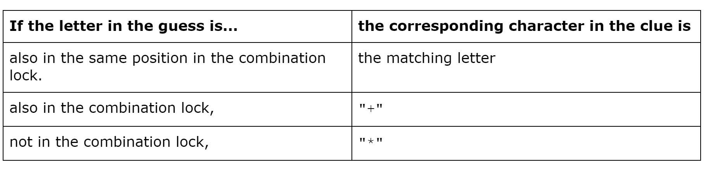
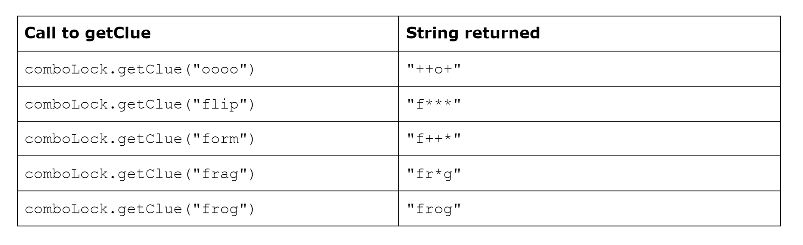

# Combination Lock
Consider a game with a combination lock box that has a 4-letter word as the combination. A player tries to guess the combination by guessing one letter at a time to win a prize inside the box. The combination only contains 4 lower-case letters and a guess can only contain 4 lower-case letters.

For each round of play, the player is given a clue based on a comparison between the combination lock and the guess. Each position in the clue contains a character that corresponds to the letter in the same position in the guess. The following rules determine the characters that appear in the clue.



The `CombinationLock` class will be used to represent the combination lock in the game. The combination lock is passed to the constructor. The class contains a method, `getClue`, that takes a guess and produces a clue.

For example, suppose the variable `comboLock` is declared as follows:
```
CombinationLock comboLock = new CombinationLock("frog");
```

The following table shows several guesses and hints that would be produced.



Write the complete `CombinationLock` class, including any required instance variables, its constructor, and the method `getClue`, described above.  
